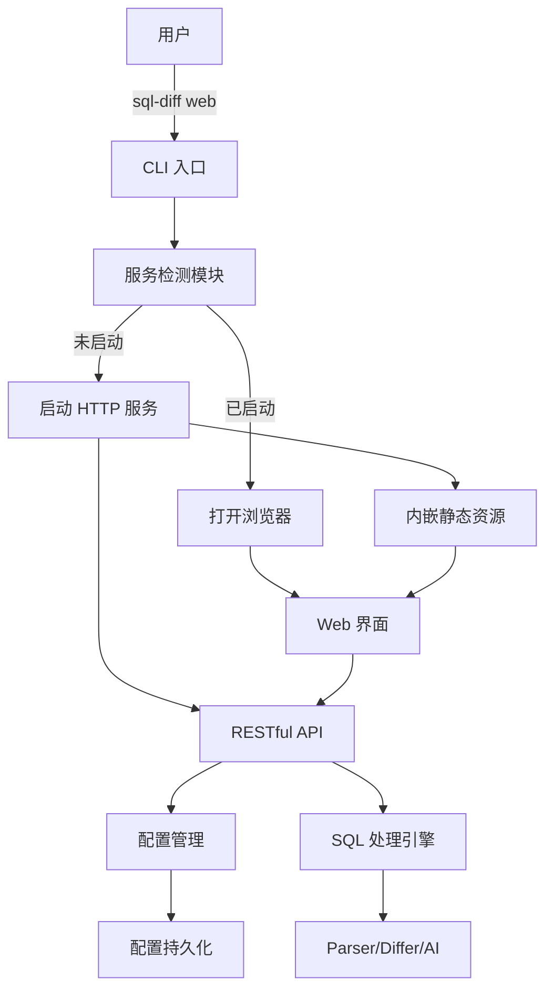
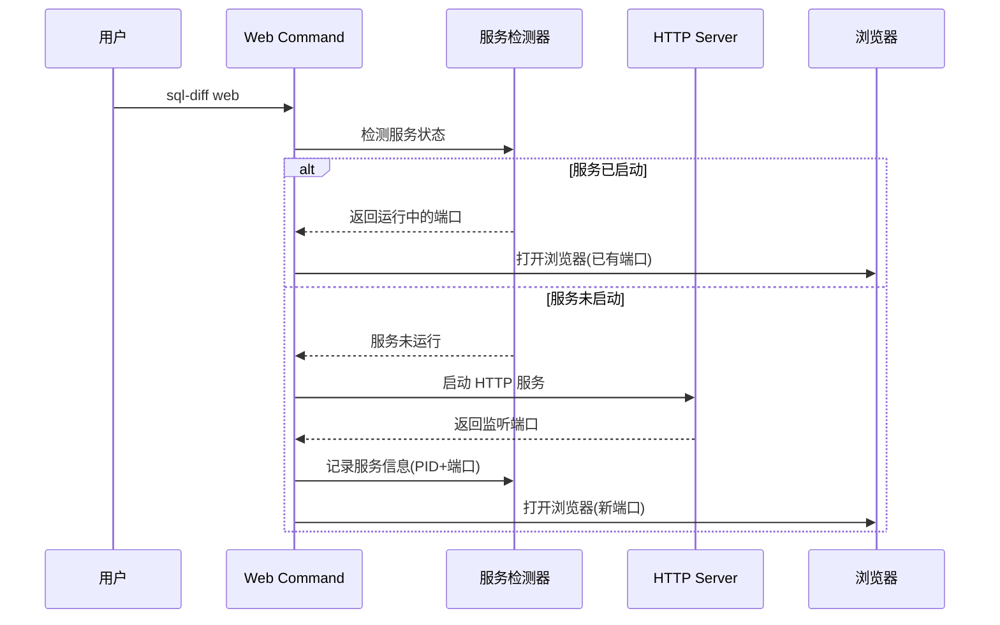
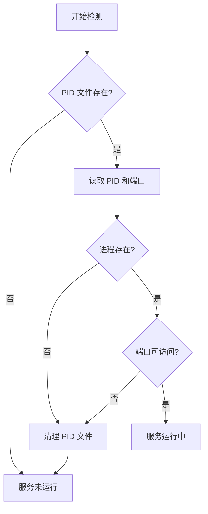
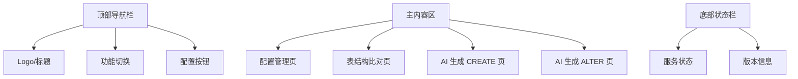
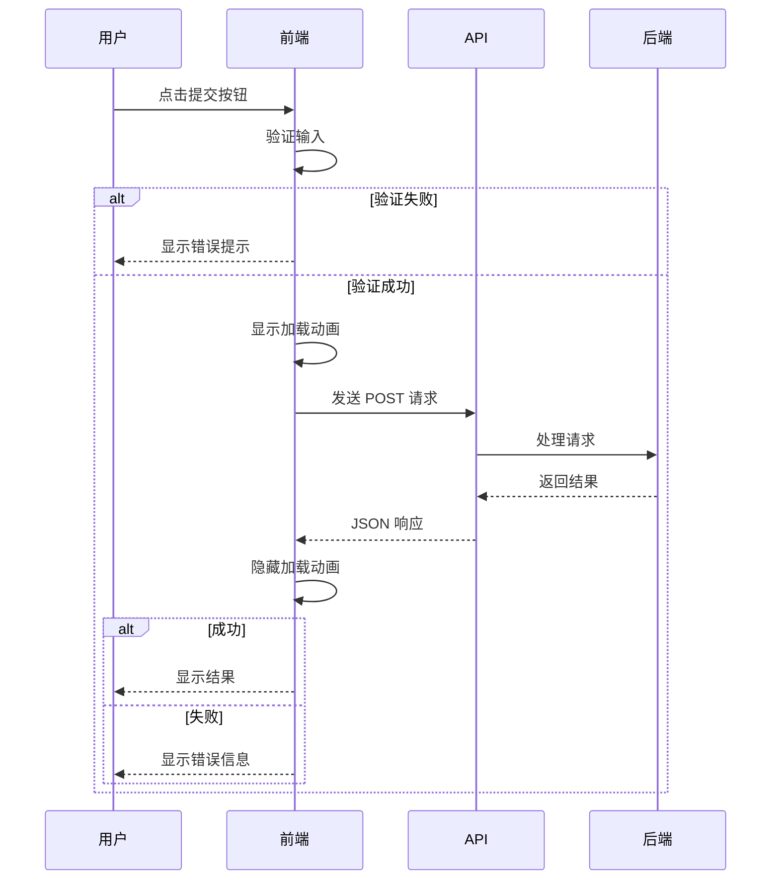
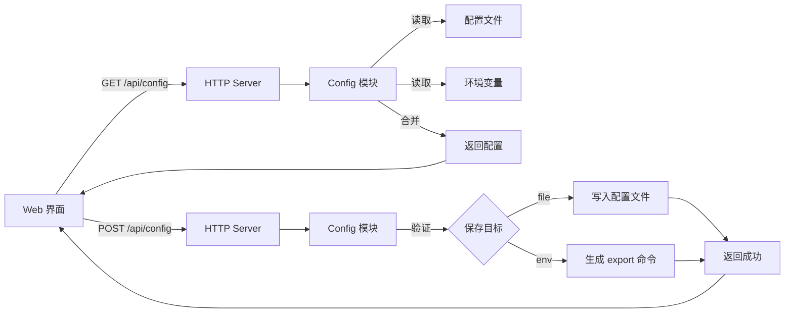
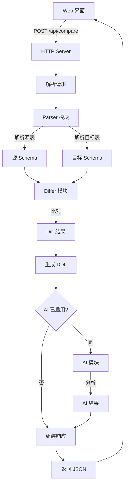
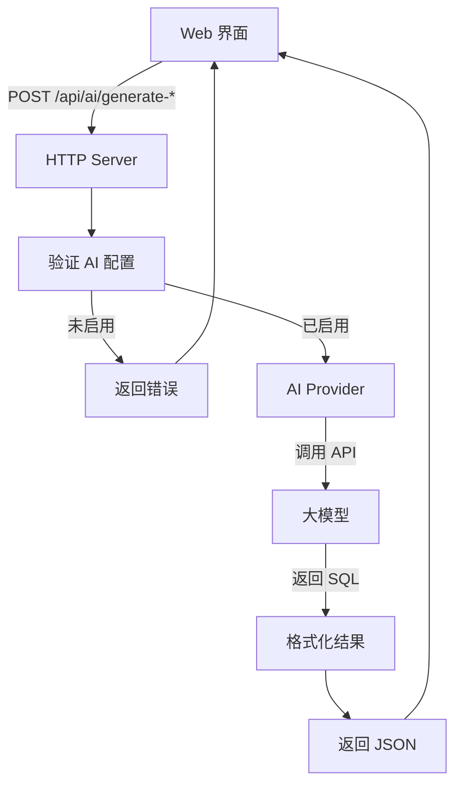

# SQL-Diff Web 可视化界面设计

## 设计目标

为 SQL-Diff 工具添加 Web 可视化界面,通过内嵌网页的方式提供友好的配置管理和功能操作界面,降低命令行使用门槛,提升用户体验。

## 核心需求

### 功能需求

1. **Web 服务启动**: 通过 `sql-diff web` 命令启动内嵌 Web 服务
2. **服务单例检测**: 检测是否已有服务运行,避免重复启动
3. **自动浏览器打开**: 启动服务后自动打开默认浏览器
4. **配置可视化管理**: 提供友好的配置界面管理 AI 相关配置
5. **功能可视化操作**: 在 Web 界面完成现有所有核心功能
   - SQL 表结构比对
   - AI 生成 CREATE TABLE
   - AI 生成 ALTER TABLE
6. **配置持久化**: 支持保存到配置文件和环境变量

### 非功能需求

1. **最小成本**: 使用纯 HTML/CSS/JS 实现,内嵌到二进制,无额外依赖
2. **跨平台**: 支持 Windows/macOS/Linux
3. **向下兼容**: 不影响现有 CLI 命令的使用
4. **安全性**: 本地服务,仅监听 localhost

## 技术方案

### 整体架构



### 技术选型

| 组件 | 技术方案 | 说明 |
|------|---------|------|
| HTTP 服务 | Go net/http 标准库 | 轻量级,无额外依赖 |
| 静态资源 | embed.FS 内嵌 | 编译时嵌入 HTML/CSS/JS |
| 前端框架 | 纯 HTML/CSS/JS | 无构建依赖,最小成本 |
| 前端样式 | CSS3 + 简洁设计 | 现代化响应式界面 |
| API 协议 | RESTful JSON | 标准化,易于调试 |
| 服务检测 | PID 文件 + 端口探测 | 双重检测保证准确性 |
| 浏览器打开 | open/start/xdg-open | 跨平台命令调用 |

## 模块设计

### 1. Web 命令模块

#### 职责
- 接收 `sql-diff web` 命令
- 执行服务检测和启动逻辑
- 管理浏览器打开

#### 关键流程



#### 端口分配策略

1. **默认端口**: 8848
2. **端口冲突处理**: 从默认端口开始递增尝试(8848, 8849, 8850...)
3. **最大尝试次数**: 10 次
4. **端口范围**: 8848-8857

### 2. 服务检测模块

#### 职责
- 判断服务是否已启动
- 记录和清理服务状态
- 处理异常退出情况

#### 检测策略

采用双重检测机制确保准确性:

| 检测方式 | 存储位置 | 内容 | 优势 | 劣势 |
|---------|---------|------|------|------|
| PID 文件 | ~/.sql-diff/web.pid | 进程ID + 端口号 | 准确可靠 | 异常退出时未清理 |
| 端口探测 | - | TCP 连接测试 | 容错性强 | 可能误判其他服务 |

#### 检测流程



#### PID 文件格式

文件路径: `~/.sql-diff/web.pid`

内容格式:
```
<进程ID>:<端口号>
```

示例:
```
12345:8848
```

### 3. HTTP 服务模块

#### 职责
- 提供静态资源服务
- 提供 RESTful API
- 处理跨域和安全问题

#### 路由设计

| 路径 | 方法 | 功能 | 说明 |
|------|------|------|------|
| `/` | GET | 主页 | 返回 index.html |
| `/api/config` | GET | 获取配置 | 返回当前配置(脱敏) |
| `/api/config` | POST | 保存配置 | 更新配置文件 |
| `/api/config/export` | GET | 导出环境变量 | 生成 export 命令 |
| `/api/compare` | POST | 表结构比对 | 执行 diff 逻辑 |
| `/api/ai/generate-create` | POST | 生成 CREATE TABLE | 调用 AI 生成建表语句 |
| `/api/ai/generate-alter` | POST | 生成 ALTER TABLE | 调用 AI 生成变更语句 |
| `/api/health` | GET | 健康检查 | 用于服务检测 |

#### API 数据结构

##### 配置相关

获取配置响应:
```json
{
  "ai": {
    "enabled": true,
    "provider": "deepseek",
    "api_key": "sk-***",
    "api_endpoint": "https://api.deepseek.com/v1",
    "model": "deepseek-chat",
    "timeout": 30
  }
}
```

保存配置请求:
```json
{
  "ai": {
    "enabled": true,
    "provider": "deepseek",
    "api_key": "sk-your-key",
    "api_endpoint": "https://api.deepseek.com/v1",
    "model": "deepseek-chat",
    "timeout": 30
  },
  "save_to": "file"
}
```

save_to 可选值:
- `file`: 保存到 .sql-diff-config.yaml
- `env`: 仅生成环境变量命令(不实际保存)

##### 表结构比对

请求:
```json
{
  "source_sql": "CREATE TABLE users ...",
  "target_sql": "CREATE TABLE users ...",
  "enable_ai": false
}
```

响应:
```json
{
  "has_changes": true,
  "summary": "新增 2 列, 修改 1 列",
  "ddls": [
    "ALTER TABLE users ADD COLUMN email VARCHAR(255)",
    "ALTER TABLE users MODIFY COLUMN name VARCHAR(200)"
  ],
  "ai_analysis": {
    "summary": "...",
    "suggestions": ["..."],
    "risks": ["..."],
    "best_practice": ["..."]
  }
}
```

##### AI 生成 CREATE TABLE

请求:
```json
{
  "description": "创建用户表,包含ID、用户名、邮箱、密码"
}
```

响应:
```json
{
  "sql": "CREATE TABLE users (...)",
  "success": true,
  "error": ""
}
```

##### AI 生成 ALTER TABLE

请求:
```json
{
  "current_ddl": "CREATE TABLE users ...",
  "description": "添加手机号字段"
}
```

响应:
```json
{
  "sqls": [
    "ALTER TABLE users ADD COLUMN phone VARCHAR(20)"
  ],
  "success": true,
  "error": ""
}
```

#### 安全设计

1. **监听地址**: 仅监听 127.0.0.1,禁止外部访问
2. **敏感信息脱敏**: API Key 返回时显示为 `sk-***`
3. **CORS 控制**: 仅允许本地源
4. **输入验证**: 对 SQL 语句和描述进行基本校验

### 4. 静态资源模块

#### 职责
- 提供 Web 界面的 HTML/CSS/JS 文件
- 编译时内嵌到二进制

#### 目录结构

```
internal/web/
├── static/
│   ├── index.html      # 主页面
│   ├── css/
│   │   └── style.css   # 样式文件
│   └── js/
│       ├── app.js      # 主应用逻辑
│       ├── config.js   # 配置管理
│       ├── compare.js  # 表结构比对
│       └── ai.js       # AI 功能
└── embed.go            # 资源嵌入
```

#### 内嵌方式

使用 Go 1.16+ 的 embed 特性:

文件: `internal/web/embed.go`

关键点:
- 使用 `//go:embed` 指令嵌入整个 static 目录
- 编译时自动打包所有静态资源
- 运行时通过 embed.FS 访问

### 5. Web 界面设计

#### 整体布局



#### 页面结构

**1. 配置管理页**

功能模块:
- AI 启用开关
- 提供商选择(DeepSeek/OpenAI/自定义)
- API Key 输入(带显示/隐藏切换)
- API Endpoint 输入
- Model 输入
- Timeout 设置
- 保存目标选择(文件/环境变量)
- 保存按钮
- 测试连接按钮

界面元素:
- 表单分组显示
- 实时验证提示
- 成功/失败提示

**2. 表结构比对页**

功能模块:
- 源表 SQL 输入框(多行文本)
- 目标表 SQL 输入框(多行文本)
- AI 分析开关
- 比对按钮
- 结果展示区
  - 差异摘要
  - DDL 语句列表(分类显示: 新增/修改/删除)
  - AI 分析结果(如启用)
- 复制按钮
- 下载按钮

界面元素:
- 可调节大小的文本框
- 语法高亮显示(可选)
- 分类彩色标签
- 一键复制功能

**3. AI 生成 CREATE TABLE 页**

功能模块:
- 需求描述输入框
- 生成按钮
- 结果展示区
  - 生成的 SQL 语句
  - 格式化显示
- 复制按钮
- 下载按钮

界面元素:
- 提示示例
- 加载动画
- 错误提示

**4. AI 生成 ALTER TABLE 页**

功能模块:
- 现有表结构输入框(多行文本)
- 修改需求描述输入框
- 生成按钮
- 结果展示区
  - 生成的 ALTER 语句列表
  - 格式化显示
- 复制按钮
- 下载按钮

界面元素:
- 两段式输入
- 提示示例
- 加载动画
- 错误提示

#### 样式设计原则

1. **简洁现代**: 扁平化设计,去除多余装饰
2. **响应式**: 支持不同屏幕尺寸
3. **色彩方案**:
   - 主色调: 蓝色系(专业感)
   - 成功: 绿色
   - 警告: 黄色
   - 错误: 红色
   - 背景: 浅灰/白色
4. **字体**: 系统默认无衬线字体,代码使用等宽字体
5. **交互反馈**: 按钮悬停效果,加载动画,操作提示

#### 前端交互逻辑

**页面切换**:
- 单页应用(SPA)模式
- 通过显示/隐藏 div 切换页面
- 更新 URL hash(如 `#config`, `#compare`)
- 浏览器前进/后退支持

**数据提交流程**:



**实时验证**:
- API Key 格式检查
- SQL 语句非空检查
- URL 格式验证
- 数字范围验证

### 6. 配置持久化模块

#### 职责
- 读取现有配置
- 保存配置到文件
- 生成环境变量命令

#### 配置优先级

保持与现有逻辑一致:
```
环境变量 > 配置文件 > 默认值
```

#### 保存逻辑

**保存到文件**:
1. 读取用户输入的配置
2. 验证配置有效性
3. 序列化为 YAML 格式
4. 写入 `.sql-diff-config.yaml`
5. 返回成功/失败状态

**生成环境变量**:
1. 读取用户输入的配置
2. 生成 `export` 命令列表
3. 返回给前端显示
4. 用户手动复制执行

环境变量格式:
```bash
export SQL_DIFF_AI_ENABLED=true
export SQL_DIFF_AI_PROVIDER=deepseek
export SQL_DIFF_AI_API_KEY=sk-xxx
export SQL_DIFF_AI_ENDPOINT=https://api.deepseek.com/v1
export SQL_DIFF_AI_MODEL=deepseek-chat
export SQL_DIFF_AI_TIMEOUT=30
```

#### 配置文件路径

默认路径: 当前目录或用户主目录下的 `.sql-diff-config.yaml`

保存优先级:
1. 当前目录(如果有写权限)
2. 用户主目录 `~/.sql-diff-config.yaml`

### 7. 浏览器打开模块

#### 职责
- 跨平台打开默认浏览器
- 处理打开失败的情况

#### 跨平台实现

| 操作系统 | 命令 | 说明 |
|---------|------|------|
| macOS | `open <URL>` | 系统内置命令 |
| Windows | `start <URL>` | CMD 命令 |
| Linux | `xdg-open <URL>` | 标准工具 |

#### 实现策略

1. 检测操作系统类型
2. 执行对应的打开命令
3. 如果失败,输出 URL 提示用户手动打开

#### 打开时机

- 服务启动成功后立即打开
- 检测到服务已运行时也打开(方便重新访问)

## 数据流设计

### 配置管理流程



### 表结构比对流程



### AI 生成流程



## 错误处理

### 错误分类

| 错误类型 | HTTP 状态码 | 处理方式 |
|---------|-----------|---------|
| 配置验证失败 | 400 | 返回详细错误信息 |
| SQL 解析失败 | 400 | 返回解析错误位置 |
| AI 未启用 | 403 | 提示需要配置 AI |
| AI API 调用失败 | 500 | 返回 AI 错误信息 |
| 文件写入失败 | 500 | 返回权限错误提示 |
| 服务启动失败 | - | 命令行输出错误 |

### 错误响应格式

```json
{
  "success": false,
  "error": "错误描述",
  "code": "ERROR_CODE",
  "details": "详细错误信息"
}
```

### 前端错误处理

1. **API 错误**: 显示错误消息,不中断用户操作
2. **网络错误**: 显示重试按钮
3. **超时错误**: 提示检查网络或 AI 服务
4. **验证错误**: 高亮错误字段,显示提示

## 性能优化

### 后端优化

1. **静态资源缓存**: 设置合理的 Cache-Control
2. **连接复用**: 复用 AI API HTTP 客户端
3. **超时控制**: 为每个 API 设置合理超时
4. **并发限制**: 限制同时处理的请求数量

### 前端优化

1. **资源压缩**: 压缩 HTML/CSS/JS(可选)
2. **按需加载**: 大的 SQL 文本延迟渲染
3. **防抖处理**: 输入验证使用防抖
4. **加载提示**: 长时间操作显示进度

## 兼容性设计

### 向下兼容

1. **CLI 命令不受影响**: Web 功能为新增,不修改现有命令
2. **配置文件兼容**: Web 保存的配置与 CLI 完全兼容
3. **环境变量兼容**: 保持现有环境变量命名和优先级

### 浏览器兼容

支持的浏览器:
- Chrome/Edge 90+
- Firefox 88+
- Safari 14+

使用的特性:
- Fetch API
- ES6 语法
- CSS Grid/Flexbox

### 降级策略

如果浏览器不支持:
- 提供纯文本输入输出
- 禁用部分 CSS 效果
- 提示升级浏览器

## 部署与发布

### 构建过程

1. **静态资源准备**: 将 HTML/CSS/JS 放入 `internal/web/static/`
2. **编译嵌入**: Go 编译时自动嵌入静态资源
3. **二进制打包**: 生成包含 Web 功能的单一可执行文件

### 发布说明

在 README 和文档中添加:
- Web 功能介绍
- 启动命令说明
- 配置界面截图
- 功能演示 GIF

### 版本兼容

- 新增命令向前兼容
- 不破坏现有用户工作流
- 配置文件格式保持一致

## 测试策略

### 单元测试

1. **服务检测逻辑**: 测试 PID 文件读写,进程检测
2. **端口分配逻辑**: 测试端口冲突处理
3. **配置序列化**: 测试 YAML 读写
4. **API 处理器**: 测试每个 API 的输入输出

### 集成测试

1. **端到端流程**: 启动服务 -> API 调用 -> 验证响应
2. **浏览器打开**: 测试跨平台命令执行
3. **配置持久化**: 测试保存后读取一致性

### 手动测试

1. **UI 交互**: 验证页面切换,表单提交
2. **错误场景**: 测试各种错误提示
3. **跨浏览器**: 在不同浏览器中验证
4. **跨平台**: 在 macOS/Windows/Linux 测试

## 使用场景示例

### 场景 1: 首次使用配置 AI

用户操作流程:
1. 执行 `sql-diff web`
2. 浏览器自动打开配置页面
3. 填写 AI 配置信息(API Key 等)
4. 点击"保存到配置文件"
5. 看到成功提示
6. 切换到"表结构比对"页面开始使用

### 场景 2: 表结构比对

用户操作流程:
1. 执行 `sql-diff web`(或服务已启动)
2. 切换到"表结构比对"页面
3. 粘贴源表 SQL 到第一个文本框
4. 粘贴目标表 SQL 到第二个文本框
5. 勾选"启用 AI 分析"(可选)
6. 点击"开始比对"
7. 查看差异摘要和 DDL 语句
8. 点击"复制"或"下载"保存结果

### 场景 3: AI 生成建表语句

用户操作流程:
1. 切换到"AI 生成 CREATE TABLE"页面
2. 输入需求描述: "创建用户表,包含ID、用户名、邮箱、密码、创建时间"
3. 点击"生成"
4. 等待 AI 返回结果
5. 查看生成的 SQL 语句
6. 点击"复制"保存

### 场景 4: 多次打开 Web 界面

用户操作流程:
1. 第一次执行 `sql-diff web`,服务启动,浏览器打开
2. 关闭浏览器标签页,服务继续运行
3. 第二次执行 `sql-diff web`,检测到服务已运行
4. 直接打开浏览器到已有服务,不重复启动

## 扩展性设计

### 未来可扩展功能

1. **历史记录**: 保存用户的比对历史
2. **批量处理**: 支持一次比对多个表
3. **模板管理**: 保存常用的配置模板
4. **导入导出**: 支持从数据库直接读取表结构
5. **实时协作**: 多用户共享比对结果(需要后端改造)

### 架构预留

1. **API 版本化**: 使用 `/api/v1/` 路径前缀
2. **插件机制**: 预留扩展点用于自定义处理器
3. **数据库支持**: 预留数据库连接配置项
4. **多语言**: CSS 变量和 JS 国际化准备

## 风险与应对

### 技术风险

| 风险 | 影响 | 概率 | 应对措施 |
|------|------|------|---------|
| 端口冲突无法解决 | 服务无法启动 | 低 | 提供手动指定端口选项 |
| PID 文件损坏 | 误判服务状态 | 低 | 双重检测机制(PID+端口) |
| 浏览器无法打开 | 用户体验下降 | 中 | 输出 URL 提示手动打开 |
| AI API 超时 | 功能不可用 | 中 | 设置合理超时,显示友好提示 |
| 配置文件权限问题 | 无法保存配置 | 低 | 降级到用户目录保存 |

### 用户体验风险

| 风险 | 影响 | 概率 | 应对措施 |
|------|------|------|---------|
| 界面响应慢 | 用户体验差 | 低 | 加载动画,异步处理 |
| 错误提示不清晰 | 用户困惑 | 中 | 详细错误信息和建议 |
| SQL 格式化混乱 | 阅读困难 | 低 | 基本格式化处理 |
| 大 SQL 卡顿 | 浏览器卡死 | 低 | 限制输入长度或分批渲染 |

## 交付物清单

### 代码文件

1. `internal/cmd/web.go` - Web 命令入口
2. `internal/web/server.go` - HTTP 服务实现
3. `internal/web/detector.go` - 服务检测逻辑
4. `internal/web/handler.go` - API 处理器
5. `internal/web/embed.go` - 静态资源嵌入
6. `internal/web/static/index.html` - 主页面
7. `internal/web/static/css/style.css` - 样式文件
8. `internal/web/static/js/app.js` - 主应用逻辑
9. `internal/web/static/js/config.js` - 配置管理
10. `internal/web/static/js/compare.js` - 比对功能
11. `internal/web/static/js/ai.js` - AI 功能

### 文档

1. 用户文档 - Web 功能使用指南
2. API 文档 - RESTful API 接口说明
3. 开发文档 - 前端开发和扩展说明

### 测试

1. 单元测试用例
2. 集成测试脚本
3. 手动测试检查清单

## 里程碑规划

### 阶段 1: 基础框架(第 1 周)

- Web 命令入口
- HTTP 服务基础框架
- 服务检测逻辑
- 静态资源嵌入机制
- 基本 HTML 页面框架

### 阶段 2: 配置管理(第 2 周)

- 配置管理 API
- 配置页面 UI
- 配置持久化逻辑
- 环境变量导出功能

### 阶段 3: 核心功能(第 3-4 周)

- 表结构比对 API 和 UI
- AI 生成 CREATE TABLE API 和 UI
- AI 生成 ALTER TABLE API 和 UI
- 结果展示和复制下载功能

### 阶段 4: 优化与测试(第 5 周)

- 错误处理完善
- UI/UX 优化
- 跨平台测试
- 性能优化
- 文档编写

### 阶段 5: 发布准备(第 6 周)

- 代码审查
- 集成测试
- 发布说明
- 用户文档
- 版本发布

## 成功标准

### 功能完整性

- 所有核心功能在 Web 界面可用
- 配置管理功能完整
- 与 CLI 功能一致

### 性能指标

- 服务启动时间 < 1 秒
- 页面加载时间 < 2 秒
- API 响应时间 < 100ms(不含 AI 调用)
- AI 调用超时设置合理(30 秒)

### 用户体验

- 界面简洁美观
- 操作流程顺畅
- 错误提示清晰
- 跨平台体验一致

### 兼容性

- 支持主流浏览器
- 支持 Windows/macOS/Linux
- 向下兼容现有 CLI
- 配置文件格式兼容

## 信心评估

**信心等级**: 高

**信心依据**:
1. **技术方案成熟**: 使用 Go 标准库和成熟的 embed 特性,无复杂依赖
2. **需求清晰**: 功能范围明确,与现有 CLI 功能对齐
3. **架构简单**: 单体应用,HTTP + JSON,实现路径直接
4. **风险可控**: 主要风险已识别并有应对措施
5. **可验证性强**: 功能可直接在浏览器中验证,易于测试

**关键成功因素**:
1. 静态资源内嵌正确实现
2. 服务检测逻辑健壮可靠
3. 前端交互逻辑清晰易维护
4. API 设计合理,易于扩展
