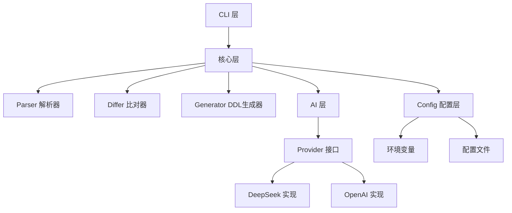
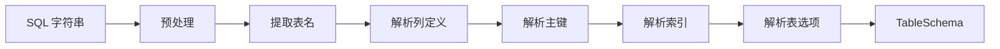
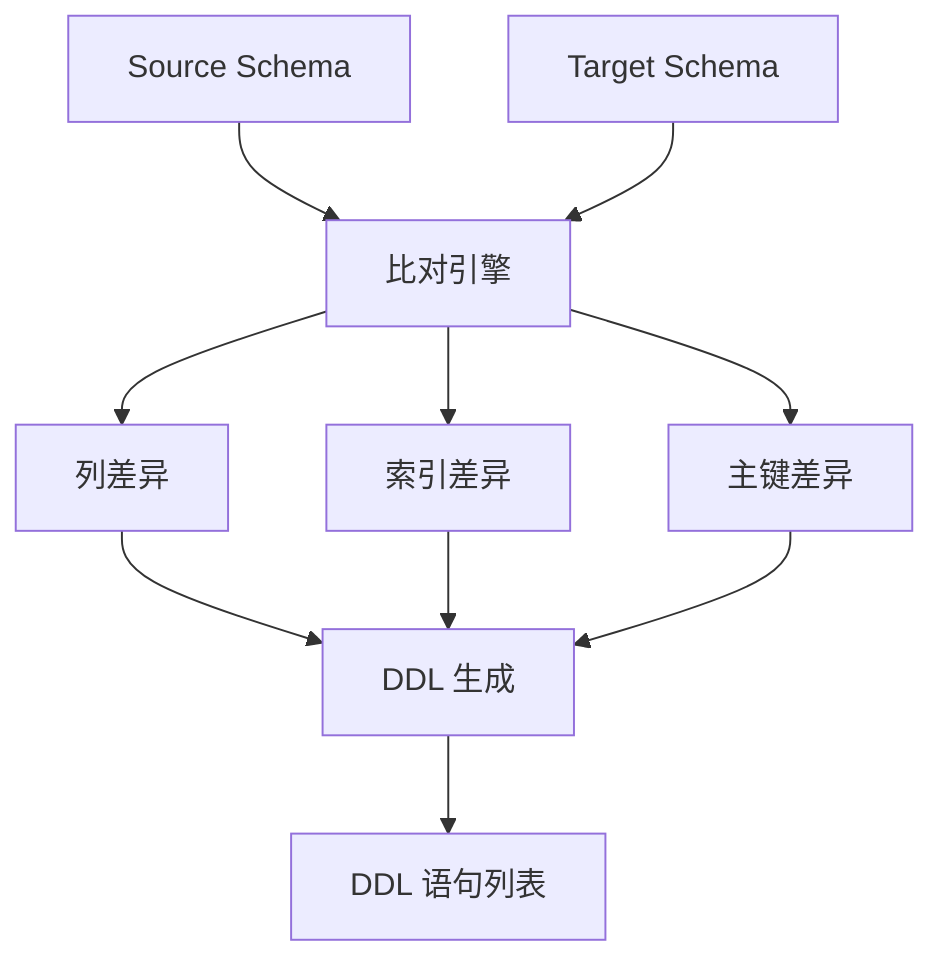
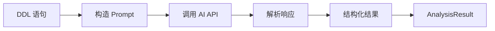
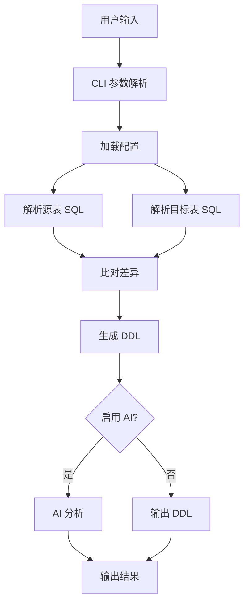

# 架构设计

SQL-Diff 采用模块化的架构设计,清晰的分层和组件划分使得代码易于维护和扩展。

## 系统架构



## 分层设计

### 1. CLI 层 (Command Line Interface)

**位置**: `cmd/sql-diff/`, `internal/cmd/`

**职责**:
- 处理命令行参数解析
- 用户交互和输出格式化
- 调用核心层功能

**主要组件**:
- `cmd/sql-diff/main.go` - 程序入口
- `internal/cmd/root.go` - 主命令实现
- `internal/cmd/config.go` - 配置命令

**技术选型**:
- [Cobra](https://github.com/spf13/cobra) - CLI 框架
- [fatih/color](https://github.com/fatih/color) - 彩色输出

### 2. 核心层 (Core)

**位置**: `internal/parser/`, `internal/differ/`

**职责**:
- SQL 解析和 AST 构建
- 表结构差异比对
- DDL 语句生成

#### Parser 解析器

```go
// internal/parser/parser.go
type TableSchema struct {
    Name        string
    Columns     []Column
    PrimaryKeys []string
    Indexes     []Index
    TableOptions map[string]string
}

type Column struct {
    Name       string
    Type       string
    Nullable   bool
    Default    string
    Extra      string
}

type Index struct {
    Name    string
    Type    string
    Columns []string
}

// 核心解析函数
func ParseCreateTable(sql string) (*TableSchema, error)
```

**解析流程**:



#### Differ 比对器

```go
// internal/differ/differ.go
type Differ struct {
    source *parser.TableSchema
    target *parser.TableSchema
}

// 比对并生成 DDL
func (d *Differ) GenerateDDL() []string

// 内部方法
func (d *Differ) compareColumns() []string
func (d *Differ) compareIndexes() []string
func (d *Differ) comparePrimaryKeys() []string
```

**比对流程**:



### 3. AI 层 (AI Integration)

**位置**: `internal/ai/`

**职责**:
- AI 提供商抽象
- 请求/响应处理
- 结果解析

#### Provider 接口

```go
// internal/ai/provider.go
type Provider interface {
    Analyze(ddls []string) (*AnalysisResult, error)
}

type AnalysisResult struct {
    Summary      string
    Suggestions  []string
    Risks        []string
    BestPractice []string
}

// DeepSeek 实现
type DeepSeekProvider struct {
    apiKey  string
    apiURL  string
    model   string
    timeout time.Duration
}
```

**AI 处理流程**:



### 4. 配置层 (Configuration)

**位置**: `internal/config/`

**职责**:
- 配置加载和管理
- 环境变量处理
- 配置文件解析

```go
// internal/config/config.go
type Config struct {
    AI AIConfig `yaml:"ai"`
}

type AIConfig struct {
    Enabled bool   `yaml:"enabled"`
    APIKey  string `yaml:"api_key"`
    Provider string `yaml:"provider"`
    Model   string `yaml:"model"`
}

// 配置加载优先级
func Load() (*Config, error) {
    // 1. 默认配置
    config := DefaultConfig()
    
    // 2. 配置文件
    loadFromFile(config)
    
    // 3. 环境变量 (优先级最高)
    loadFromEnv(config)
    
    return config, nil
}
```

## 数据流

### 完整的数据流程



### 典型使用场景的数据流

**场景: 带 AI 分析的表结构比对**

1. **输入阶段**:
   ```
   用户执行: sql-diff -s "..." -t "..." --ai
   ```

2. **解析阶段**:
   ```
   Parser.ParseCreateTable(source) -> TableSchema
   Parser.ParseCreateTable(target) -> TableSchema
   ```

3. **比对阶段**:
   ```
   Differ.New(sourceSchema, targetSchema)
   Differ.GenerateDDL() -> []string (DDL 语句)
   ```

4. **AI 分析阶段**:
   ```
   AIProvider.Analyze(ddls) -> AnalysisResult
   ```

5. **输出阶段**:
   ```
   Format and print:
   - DDL statements (colored, categorized)
   - AI analysis (summary, suggestions, risks)
   ```

## 扩展点

### 1. 支持更多数据库

当前只支持 MySQL,可扩展支持其他数据库:

```go
// internal/parser/parser.go
type Parser interface {
    ParseCreateTable(sql string) (*TableSchema, error)
}

type MySQLParser struct {}
type PostgreSQLParser struct {}
type SQLiteParser struct {}
```

### 2. 支持更多 AI 提供商

```go
// internal/ai/provider.go
type Provider interface {
    Analyze(ddls []string) (*AnalysisResult, error)
}

// 已实现
type DeepSeekProvider struct {}

// 可扩展
type OpenAIProvider struct {}
type ClaudeProvider struct {}
type CustomProvider struct {}
```

### 3. 输出格式扩展

```go
// internal/formatter/formatter.go
type Formatter interface {
    Format(ddls []string, analysis *ai.AnalysisResult) string
}

type TextFormatter struct {}
type JSONFormatter struct {}
type MarkdownFormatter struct {}
type HTMLFormatter struct {}
```

## 性能优化

### 1. 解析性能

- 使用正则表达式预编译
- 避免不必要的字符串操作
- 缓存解析结果

```go
var (
    columnRegex = regexp.MustCompile(`...`)
    indexRegex  = regexp.MustCompile(`...`)
)
```

### 2. AI 调用优化

- 请求缓存
- 批量分析
- 超时控制

```go
type CachedProvider struct {
    provider Provider
    cache    map[string]*AnalysisResult
    ttl      time.Duration
}
```

### 3. 并发处理

对于多表比对,使用协程并发处理:

```go
func CompareMultipleTables(pairs []TablePair) []Result {
    results := make(chan Result, len(pairs))
    
    for _, pair := range pairs {
        go func(p TablePair) {
            result := CompareTables(p.Source, p.Target)
            results <- result
        }(pair)
    }
    
    // 收集结果
    return collectResults(results, len(pairs))
}
```

## 错误处理

### 错误类型

```go
// internal/errors/errors.go
var (
    ErrInvalidSQL       = errors.New("invalid SQL syntax")
    ErrParseFailure     = errors.New("failed to parse SQL")
    ErrAPICallFailed    = errors.New("AI API call failed")
    ErrConfigNotFound   = errors.New("configuration not found")
)

type ParseError struct {
    SQL   string
    Line  int
    Cause error
}

func (e *ParseError) Error() string {
    return fmt.Sprintf("parse error at line %d: %v", e.Line, e.Cause)
}
```

### 错误处理策略

1. **解析错误**: 返回详细错误信息,提示用户 SQL 语法问题
2. **AI 错误**: 降级处理,只输出 DDL,不影响核心功能
3. **配置错误**: 使用默认配置,给出警告

## 测试策略

### 单元测试

```go
// internal/parser/parser_test.go
func TestParseSimpleTable(t *testing.T) {
    sql := `CREATE TABLE users (id INT PRIMARY KEY)`
    schema, err := ParseCreateTable(sql)
    
    assert.NoError(t, err)
    assert.Equal(t, "users", schema.Name)
    assert.Len(t, schema.Columns, 1)
}
```

### 集成测试

```go
// internal/integration_test.go
func TestEndToEnd(t *testing.T) {
    source := `CREATE TABLE users (id INT)`
    target := `CREATE TABLE users (id INT, name VARCHAR(100))`
    
    ddls := CompareTables(source, target)
    
    assert.Contains(t, ddls, "ADD COLUMN name VARCHAR(100)")
}
```

### 测试覆盖率

```bash
go test -cover ./...
```

目标: 保持 80%+ 的代码覆盖率

## 部署架构

### 本地安装

```
go install github.com/Bacchusgift/sql-diff/cmd/sql-diff@latest
```

### Docker 部署

```dockerfile
FROM golang:1.21-alpine
RUN go install github.com/Bacchusgift/sql-diff/cmd/sql-diff@latest
ENTRYPOINT ["sql-diff"]
```

### CI/CD 集成

在 GitHub Actions / GitLab CI 中使用:

```yaml
- name: Install SQL-Diff
  run: go install github.com/Bacchusgift/sql-diff/cmd/sql-diff@latest

- name: Compare schemas
  run: sql-diff -s old.sql -t new.sql --ai
```

## 依赖管理

### 核心依赖

```go
// go.mod
require (
    github.com/spf13/cobra v1.8.0        // CLI 框架
    github.com/fatih/color v1.16.0       // 彩色输出
    gopkg.in/yaml.v3 v3.0.1              // YAML 配置
)
```

### 无外部运行时依赖

编译后的二进制文件可独立运行,无需任何外部依赖。

## 未来规划

### 短期 (v1.1)
- [ ] 支持 PostgreSQL
- [ ] 支持更多 AI 提供商 (OpenAI, Claude)
- [ ] JSON/Markdown 输出格式
- [ ] DDL 执行模拟

### 中期 (v1.2)
- [ ] GUI 界面
- [ ] 数据库直连 (无需导出 SQL)
- [ ] 批量比对优化
- [ ] 更智能的 AI 分析

### 长期 (v2.0)
- [ ] 支持更多数据库 (Oracle, SQL Server)
- [ ] 数据迁移功能
- [ ] Web 服务模式
- [ ] 团队协作功能

## 贡献指南

欢迎贡献代码、文档或提出建议。详细信息请查看项目的贡献指南文档。

## 下一步

- [快速开始](/guide/getting-started) - 开始使用 SQL-Diff
- [开发指南](https://github.com/Bacchusgift/sql-diff/blob/main/CONTRIBUTING.md) - 参与项目开发
