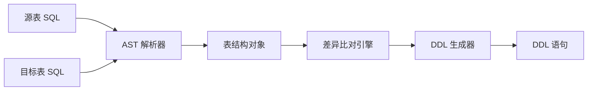

# 表结构比对

SQL-Diff 的核心功能是精准比对两个 SQL CREATE 语句的表结构差异,并生成相应的 DDL 语句。

## 工作原理

SQL-Diff 基于 **AST (抽象语法树)** 技术解析 SQL 语句:



### 1. SQL 解析

解析器会提取以下表结构信息:

- **列定义**: 列名、数据类型、约束 (NOT NULL、DEFAULT、AUTO_INCREMENT 等)
- **主键**: PRIMARY KEY 约束
- **索引**: KEY、UNIQUE KEY、FULLTEXT 等
- **表选项**: ENGINE、CHARSET、COLLATE、COMMENT 等

### 2. 差异检测

比对引擎会检测以下差异:

#### 列差异
- ✅ 新增列
- 🔄 修改列 (类型、约束变化)
- ❌ 删除列

#### 索引差异
- ✅ 新增索引
- ❌ 删除索引

#### 主键差异
- 🔄 主键变化

#### 表选项差异
- 🔄 字符集变化
- 🔄 引擎变化
- 🔄 注释变化

## 示例场景

### 场景 1: 添加新列

**源表 (Source)**:
```sql
CREATE TABLE users (
  id INT PRIMARY KEY,
  name VARCHAR(100)
);
```

**目标表 (Target)**:
```sql
CREATE TABLE users (
  id INT PRIMARY KEY,
  name VARCHAR(100),
  email VARCHAR(255) NOT NULL,
  created_at TIMESTAMP DEFAULT CURRENT_TIMESTAMP
);
```

**生成的 DDL**:
```sql
ALTER TABLE users ADD COLUMN email VARCHAR(255) NOT NULL;
ALTER TABLE users ADD COLUMN created_at TIMESTAMP DEFAULT CURRENT_TIMESTAMP;
```

### 场景 2: 修改列定义

**源表**:
```sql
CREATE TABLE products (
  id INT PRIMARY KEY,
  name VARCHAR(100),
  price DECIMAL(10,2)
);
```

**目标表**:
```sql
CREATE TABLE products (
  id INT PRIMARY KEY,
  name VARCHAR(255) NOT NULL,
  price DECIMAL(12,4)
);
```

**生成的 DDL**:
```sql
ALTER TABLE products MODIFY COLUMN name VARCHAR(255) NOT NULL;
ALTER TABLE products MODIFY COLUMN price DECIMAL(12,4);
```

### 场景 3: 索引变更

**源表**:
```sql
CREATE TABLE posts (
  id INT PRIMARY KEY,
  title VARCHAR(255),
  content TEXT,
  KEY idx_title (title)
);
```

**目标表**:
```sql
CREATE TABLE posts (
  id INT PRIMARY KEY,
  title VARCHAR(255),
  content TEXT,
  FULLTEXT KEY idx_content (content)
);
```

**生成的 DDL**:
```sql
ALTER TABLE posts DROP INDEX idx_title;
ALTER TABLE posts ADD FULLTEXT KEY idx_content (content);
```

## 高级特性

### 智能类型识别

SQL-Diff 能准确识别和比对各种 MySQL 数据类型:

- **数值类型**: INT, BIGINT, DECIMAL, FLOAT, DOUBLE
- **字符串类型**: CHAR, VARCHAR, TEXT, LONGTEXT
- **日期时间**: DATE, DATETIME, TIMESTAMP
- **二进制**: BLOB, BINARY, VARBINARY
- **枚举**: ENUM, SET

### 约束检测

支持识别以下约束:

- `NOT NULL` / `NULL`
- `DEFAULT value`
- `AUTO_INCREMENT`
- `UNSIGNED`
- `ZEROFILL`
- `ON UPDATE CURRENT_TIMESTAMP`

### 索引类型支持

支持多种索引类型:

- 普通索引 (`KEY`)
- 唯一索引 (`UNIQUE KEY`)
- 全文索引 (`FULLTEXT KEY`)
- 空间索引 (`SPATIAL KEY`)
- 复合索引 (多列)

## 使用技巧

### 1. 处理复杂表结构

对于包含大量列和索引的表,建议:

```bash
# 使用 AI 分析功能获得智能建议
sql-diff -s "$(cat source.sql)" -t "$(cat target.sql)" --ai
```

### 2. 生成可回滚的 DDL

建议先在测试环境执行生成的 DDL:

```bash
# 导出 DDL 到文件
sql-diff -s "..." -t "..." > migration.sql

# 在测试数据库中验证
mysql -h testdb -u user -p < migration.sql
```

### 3. 批量比对

使用脚本批量比对多个表:

```bash
#!/bin/bash
for table in users products orders; do
  echo "Comparing $table..."
  sql-diff \
    -s "$(cat source/${table}.sql)" \
    -t "$(cat target/${table}.sql)" \
    > ddl/${table}_migration.sql
done
```

## 限制和注意事项

### 当前限制

- 仅支持 MySQL DDL 语法
- 不支持外键约束检测
- 不支持触发器和存储过程
- 不支持分区表

### 注意事项

::: warning 数据丢失风险
删除列的 DDL 语句会导致数据永久丢失,执行前请务必备份数据!
:::

::: warning 类型转换
修改列类型时可能导致数据截断或转换失败,请在测试环境充分验证。
:::

## 最佳实践

1. **总是先在测试环境验证**: 生成的 DDL 应先在测试环境执行
2. **备份数据**: 执行结构变更前务必备份数据
3. **使用事务**: 如果可能,在事务中执行多个 DDL
4. **监控性能**: 大表的结构变更可能锁表,注意选择低峰期执行
5. **启用 AI 分析**: 对于复杂变更,使用 AI 获取优化建议

## 下一步

- [DDL 生成](/guide/ddl-generation) - 了解 DDL 生成细节
- [命令行工具](/guide/cli) - 掌握所有命令选项
- [AI 功能](/ai/guide) - 使用 AI 增强比对
